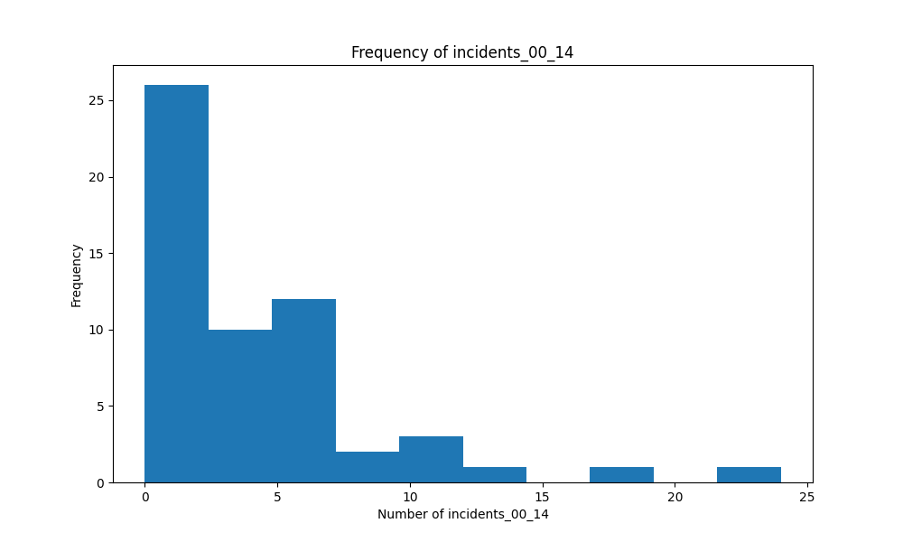

# JamieLiu_Mini9

## Colab Link

[Google Colab Link](https://colab.research.google.com/drive/1fNF6bFb0YPmg6-SBcne0ZdZrb3rkCPTK)

## Overview

This repo contains work for Data Engineering class, individual project 1. This project practices continuous integration in data science. I use the airline safety dataset and generates descriptive statistics and visualizations.

## Project Structure

## Features

- `.devcontainer` configuration for a consistent Python development environment using Docker.
- **Makefile** to streamline common tasks like setup, testing, linting.
- **GitHub Actions** for automated CI/CD pipeline (testing, linting, and deployment).
- `requirements.txt` for managing Python dependencies.

## Usage

1. **Clone the repository:**

   ```bash
   git clone git@github.com:nogibjj/JamieLiu_Mini9.git
   ```

2. **Install dependencies:**

   ```bash
   make install
   ```

3. **Format code:**

   ```bash
   make format
   ```

   

4. **Lint code:**

   ```bash
   make lint
   ```

   

5. **Test code:**

   ```bash
   make test
   ```

   

6. **Run all steps (Install, Format, Lint, Test):**

   ```bash
   make all
   ```

## **Summary Statistics**:


## **Example Visualization**:

### Incidents 00-14




See detailed statistics and visualizations in this [report](/report.md)
