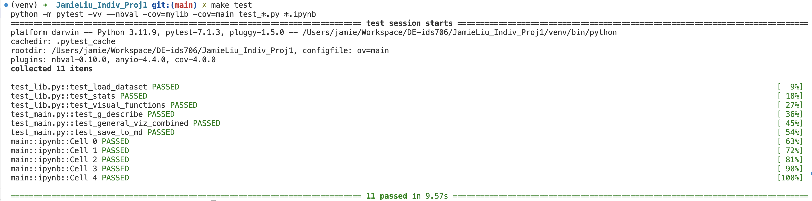
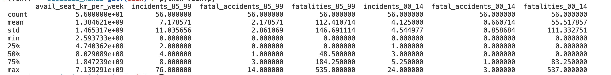
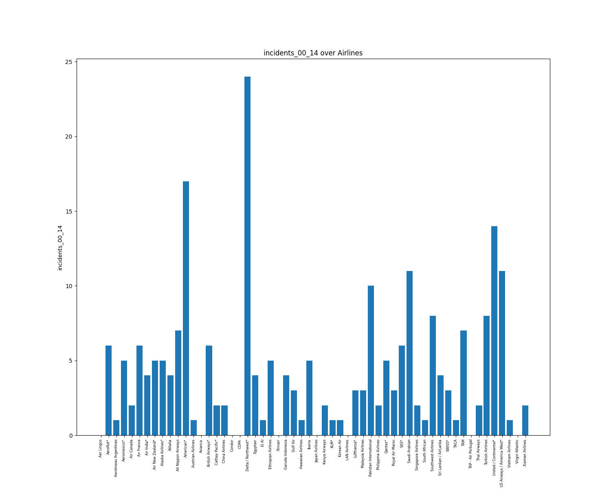
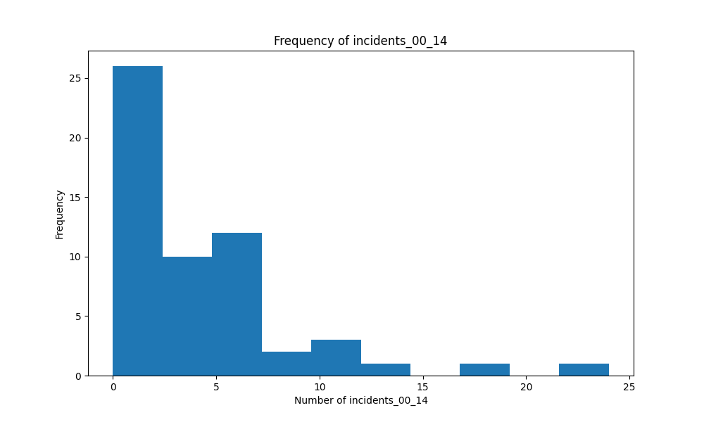

# JamieLiu_Indiv_Proj1

[](https://github.com/nogibjj/JamieLiu_Indiv_Proj1/actions/workflows/install.yml)
[](https://github.com/nogibjj/JamieLiu_Indiv_Proj1/actions/workflows/lint.yml)
[](https://github.com/nogibjj/JamieLiu_Indiv_Proj1/actions/workflows/test.yml)
[](https://github.com/nogibjj/JamieLiu_Indiv_Proj1/actions/workflows/format.yml)

## Demo Link

[Demo Link]()

## Overview

This repo contains work for Data Engineering class, individual project 1. It loads the airline safety dataset and generates descriptive statistics on the dataset.

## Project Structure

```
JAMIELIU_INDIV_PROJ1/
├── .devcontainer/
│ ├── devcontainer.json
│ └── Dockerfile
├── .github/
│ └── workflows/
│ ├── format.yml
│ ├── install.yml
│ ├── lint.yml
│ └── test.yml
├── mylib/
│ ├── **init**.py
│ └── lib.py
├── .gitignore
├── Dockerfile
├── LICENSE
├── README.md
├── main.ipynb
├── main.py
├── Makefile
├── repeat.sh
├── report.md
├── requirements.txt
├── setup.sh
├── test_lib.py
├── test_main.py
```

## Features

- `.devcontainer` configuration for a consistent Python development environment using Docker.
- **Makefile** to streamline common tasks like setup, testing, linting.
- **GitHub Actions** for automated CI/CD pipeline (testing, linting, and deployment).
- `requirements.txt` for managing Python dependencies.

## Usage

1. **Clone the repository:**

   ```bash
   git clone git@github.com:nogibjj/JamieLiu_Indiv_Proj1.git
   ```

2. **Install dependencies:**

   ```bash
   make install
   ```

3. **Format code:**

   ```bash
   make format
   ```

   

4. **Lint code:**

   ```bash
   make lint
   ```

   

5. **Test code:**

   ```bash
   make test
   ```

   

6. **Run all steps (Install, Format, Lint, Test):**

   ```bash
   make all
   ```

## **Summary Statistics**:



## **Example Visualization**:

### Incidents 00-14





See detailed statistics and visualizations in this [report](/report.md)
