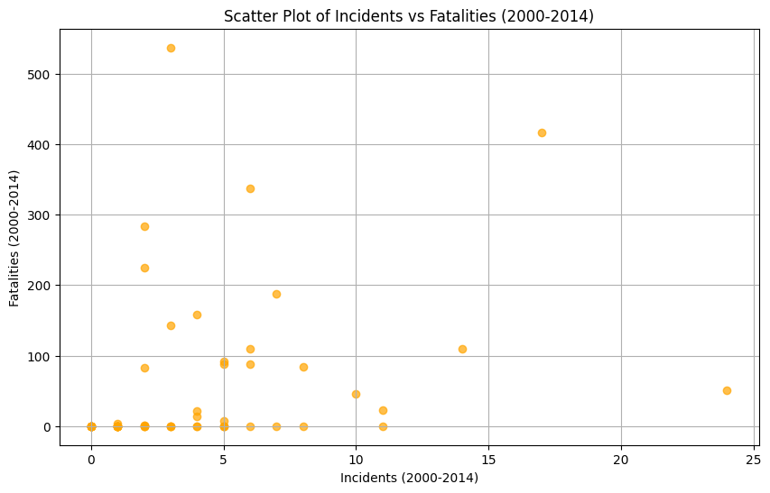

# JamieLiu_Mini9

This project involves setting up a cloud-hosted Jupyter Notebook on Google Colab, performing data manipulation tasks, and integrating a CI/CD pipeline. It demonstrates proficiency in cloud-based data analysis, project configuration, and automation.

## Colab Link

[Google Colab Link](https://colab.research.google.com/drive/1fNF6bFb0YPmg6-SBcne0ZdZrb3rkCPTK)

## Project Structure

Here’s an overview of the project structure:

```
JAMIELIU_MINI9/
├── .devcontainer/
├── .github/
├── images/
├── mylib/
├── .gitignore
├── main.py
├── Makefile
├── Mini9.ipynb           # Main Jupyter Notebook hosted on Google Colab
├── README.md
├── report.md
├── requirements.txt
├── test_lib.py
└── test_main.py
```

## Usage

1. **Clone the repository:**

   ```bash
   git clone git@github.com:nogibjj/JamieLiu_Mini9.git
   ```

2. **Install dependencies:**

   ```bash
   make install
   ```

3. **Format code:**

   ```bash
   make format
   ```

4. **Lint code:**

   ```bash
   make lint
   ```

5. **Test code:**

   ```bash
   make test
   ```

6. **Run all steps (Install, Format, Lint, Test):**

   ```bash
   make all
   ```

## **Summary Statistics**:


## **Example Visualization**:




