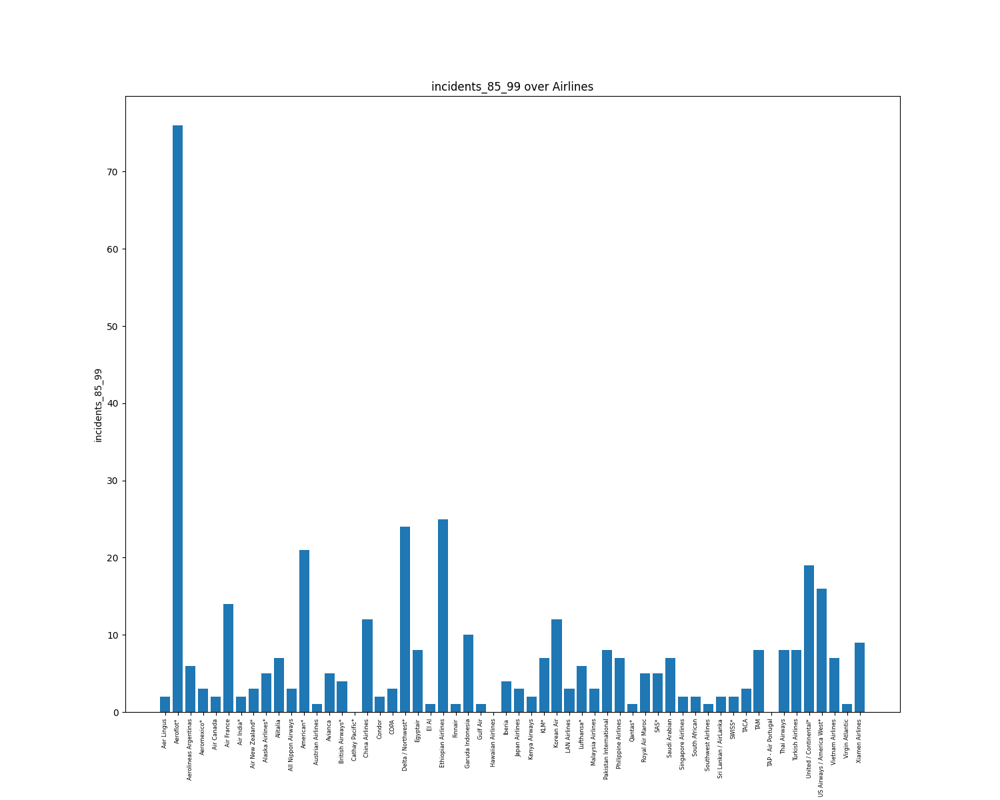
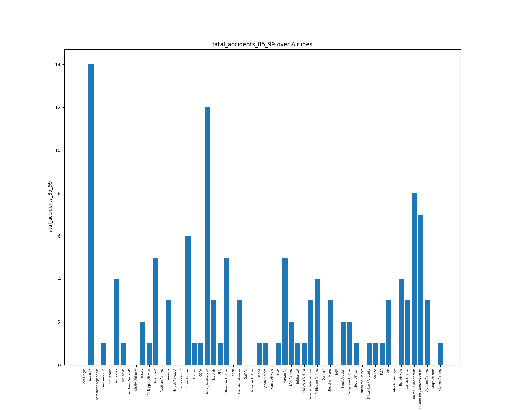
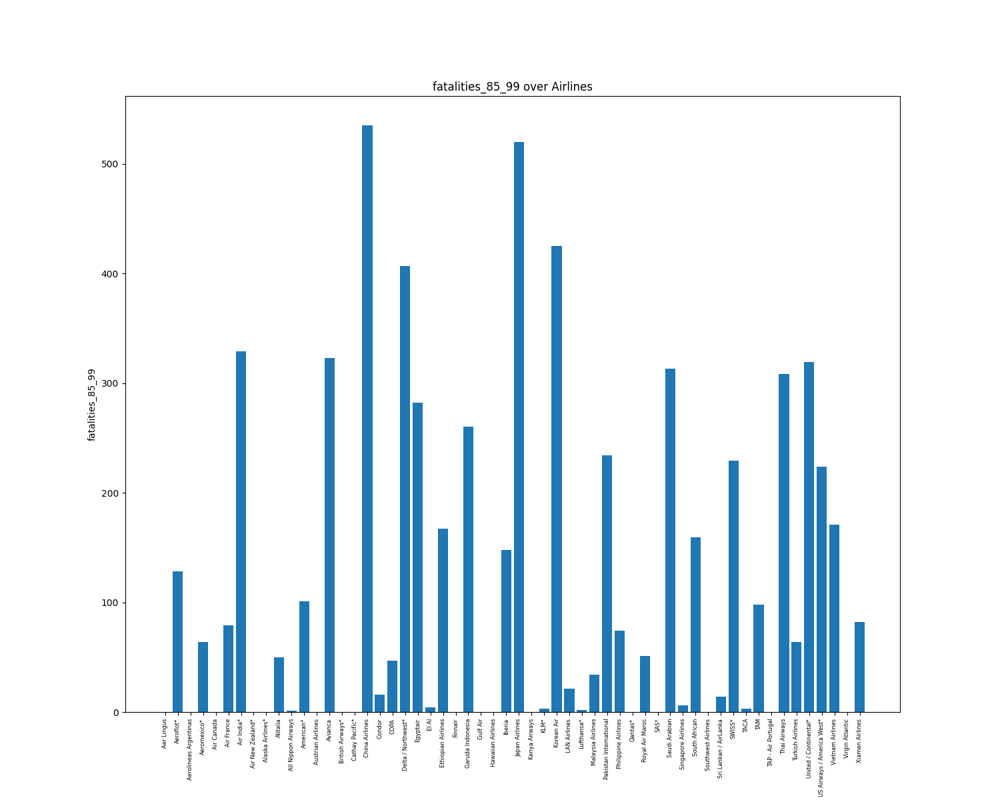
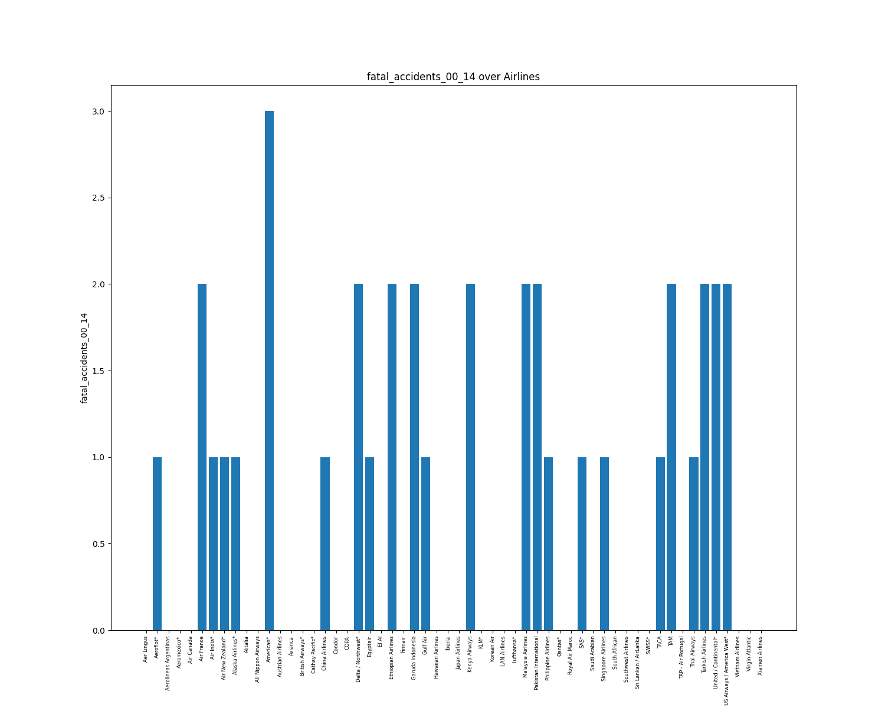
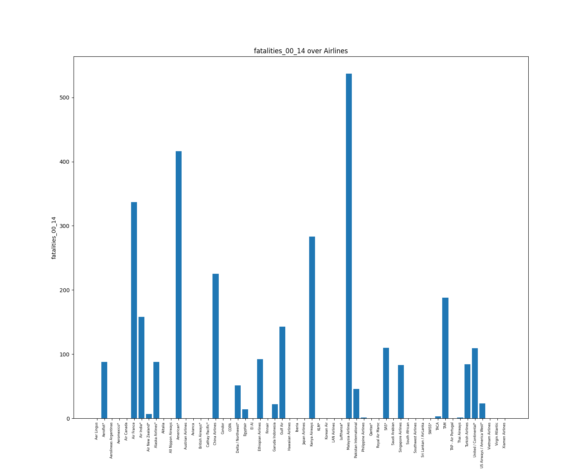

# Report

## General Description

|       | avail_seat_km_per_week | incidents_85_99 | fatal_accidents_85_99 | fatalities_85_99 | incidents_00_14 | fatal_accidents_00_14 | fatalities_00_14 |
| :---- | ---------------------: | --------------: | --------------------: | ---------------: | --------------: | --------------------: | ---------------: |
| count |                     56 |              56 |                    56 |               56 |              56 |                    56 |               56 |
| mean  |            1.38462e+09 |         7.17857 |               2.17857 |          112.411 |           4.125 |              0.660714 |          55.5179 |
| std   |            1.46532e+09 |         11.0357 |               2.86107 |          146.691 |         4.54498 |              0.858684 |          111.333 |
| min   |            2.59373e+08 |               0 |                     0 |                0 |               0 |                     0 |                0 |
| 25%   |            4.74036e+08 |               2 |                     0 |                0 |               1 |                     0 |                0 |
| 50%   |            8.02909e+08 |               4 |                     1 |             48.5 |               3 |                     0 |                0 |
| 75%   |            1.84724e+09 |               8 |                     3 |           184.25 |            5.25 |                     1 |            83.25 |
| max   |            7.13929e+09 |              76 |                    14 |              535 |              24 |                     3 |              537 |

## Visualizations

### Incidents 85-99

### Fatal Accidents 85-99

### Fatalities 85-99

### Incidents 00-14

### Fatal Accidents 00-14

### Fatalities 00-14

