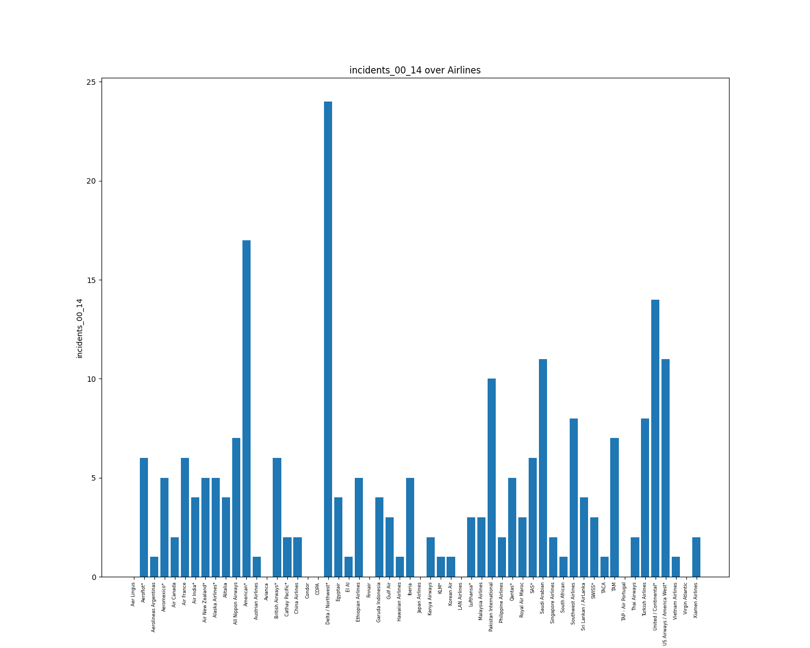

# Report

## General Description

       avail_seat_km_per_week  ...  fatalities_00_14
count            5.600000e+01  ...         56.000000
mean             1.384621e+09  ...         55.517857
std              1.465317e+09  ...        111.332751
min              2.593733e+08  ...          0.000000
25%              4.740362e+08  ...          0.000000
50%              8.029089e+08  ...          0.000000
75%              1.847239e+09  ...         83.250000
max              7.139291e+09  ...        537.000000

[8 rows x 7 columns]

## Visualizations

### Incidents 85-99

### Fatal Accidents 85-99

### Fatalities 85-99

### Incidents 00-14

### Fatal Accidents 00-14

### Fatalities 00-14

